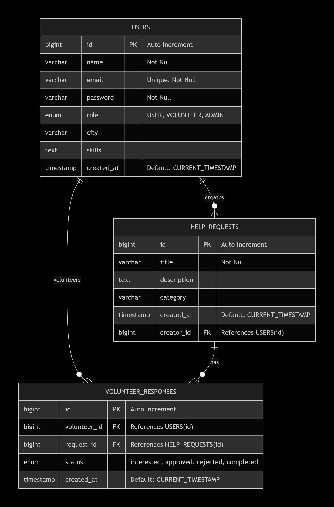
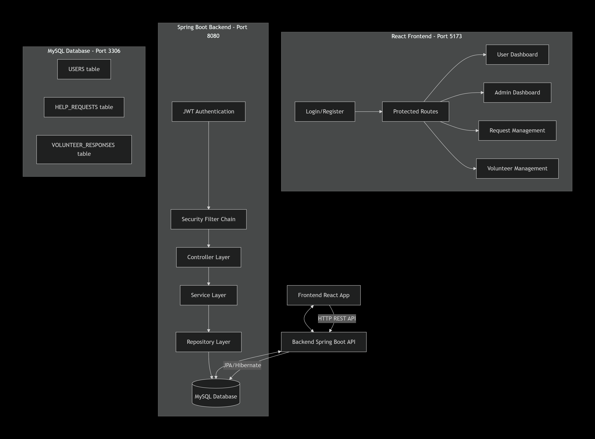
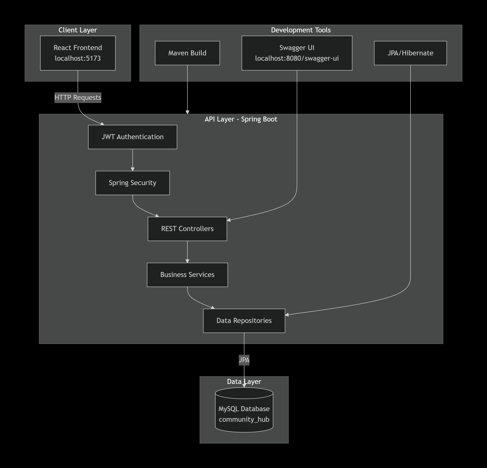
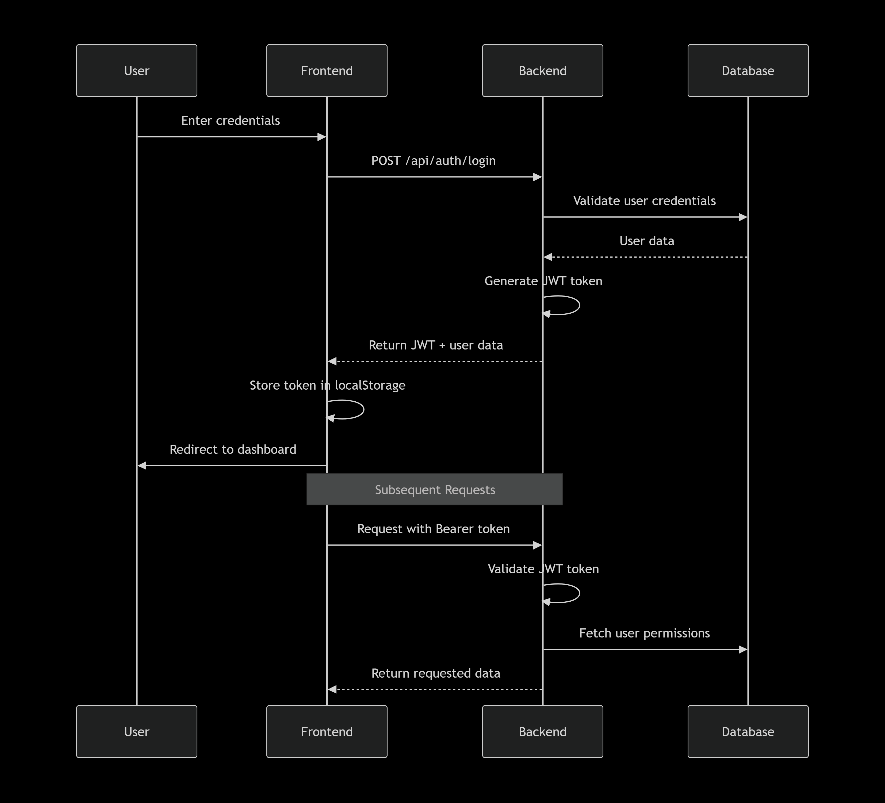
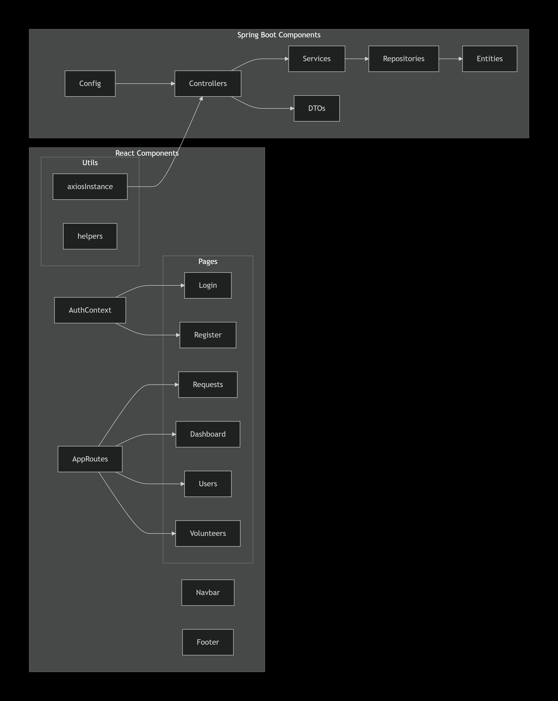
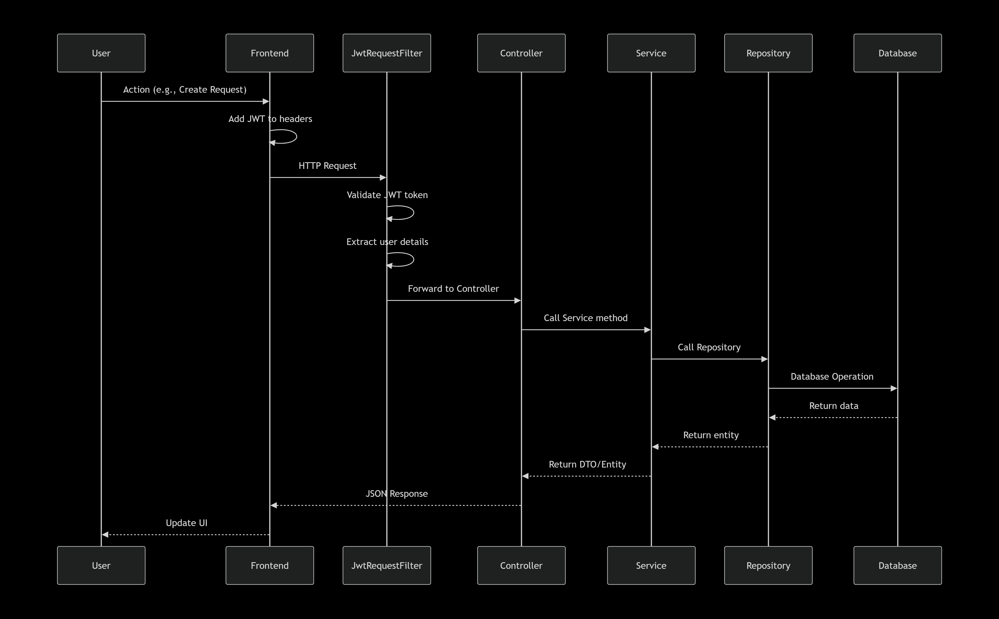

# Community Service Hub - Database ERD & System Architecture

## 📋 Quick Navigation
- [🗄️ Entity Relationship Diagram](#-entity-relationship-diagram)
- [🔄 Data Flow Architecture](#-data-flow-architecture)
- [🏗️ System Architecture](#️-system-architecture)
- [🔐 Authentication Flow](#-authentication-flow)
- [📊 Component Relationships](#-component-relationships)
- [🔄 Request Flow](#-request-flow)

---

## 🗄️ Entity Relationship Diagram

*Click image to view full size*

**Description**: This diagram shows the relationships between the three main entities in our database:
- **USERS** table stores all user information
- **HELP_REQUESTS** table stores community service requests  
- **VOLUNTEER_RESPONSES** table tracks volunteer applications

**Key Relationships**:
- One-to-Many: Users → HelpRequests
- One-to-Many: Users → VolunteerResponses  
- One-to-Many: HelpRequests → VolunteerResponses

---

## 🔄 Data Flow Architecture

*Click image to view full size*

**Description**: This diagram illustrates how data flows through the application:
- **Frontend** (React) communicates with **Backend** (Spring Boot) via HTTP
- **Backend** processes requests and interacts with **Database** (MySQL)
- **JWT Authentication** secures all API communications

**Flow Steps**:
1. User action in React frontend
2. HTTP request to Spring Boot API
3. JWT validation and security checks
4. Business logic processing
5. Database operations
6. Response returned to frontend

---

## 🏗️ System Architecture

*Click image to view full size*

**Description**: Overall system architecture showing all components and their interactions:

**Client Layer**:
- React frontend running on port 5173
- Responsive web interface

**API Layer**:
- Spring Boot backend on port 8080
- RESTful API endpoints
- JWT-based security

**Data Layer**:
- MySQL database
- JPA/Hibernate for ORM

**Development Tools**:
- Swagger UI for API documentation
- Maven for build management

---

## 🔐 Authentication Flow

*Click image to view full size*

**Description**: Step-by-step JWT authentication process:

1. **Login Request**: User submits credentials
2. **Validation**: Backend validates against database
3. **Token Generation**: JWT token created with user claims
4. **Response**: Token returned to frontend
5. **Storage**: Token stored in localStorage
6. **Subsequent Requests**: Token included in Authorization header

**Security Features**:
- Stateless authentication
- Token expiration (24 hours)
- Secure token validation

---

## 📊 Component Relationships

*Click image to view full size*

**Description**: Relationships between frontend and backend components:

**Frontend Components**:
- **AuthContext**: Global authentication state
- **AppRoutes**: Protected routing system
- **Pages**: Different views based on user role
- **Utils**: API communication helpers

**Backend Components**:
- **Controllers**: Handle HTTP requests
- **Services**: Business logic layer
- **Repositories**: Data access layer
- **Entities**: Database model classes

---

## 🗂️ Complete File Structure
Community-Service-Hub-Project/
├── 📄 PROJECT_DOCUMENTATION.md
├── 📄 ERD_DIAGRAMS.md
├── backend/
│ ├── src/main/java/com/communityhub/
│ │ ├── config/
│ │ │ ├── 🛡️ AppConfig.java
│ │ │ ├── 🛡️ JwtRequestFilter.java
│ │ │ ├── 🛡️ JwtAuthenticationEntryPoint.java
│ │ │ ├── 🛡️ WebSecurityConfig.java
│ │ │ └── 📚 SwaggerConfig.java
│ │ ├── controller/
│ │ │ ├── 🔐 AuthController.java
│ │ │ ├── 📋 RequestController.java
│ │ │ ├── 👥 UserController.java
│ │ │ ├── 🤝 VolunteerController.java
│ │ │ └── 📊 AdminStatsController.java
│ │ ├── dto/
│ │ │ ├── 📝 AuthRequest.java
│ │ │ ├── 📝 CreateRequestDto.java
│ │ │ └── 📝 LoginRequest.java
│ │ ├── model/
│ │ │ ├── 🗂️ User.java
│ │ │ ├── 🗂️ HelpRequest.java
│ │ │ ├── 🗂️ VolunteerResponse.java
│ │ │ └── 🗂️ Role.java
│ │ ├── repository/
│ │ │ ├── 💾 UserRepository.java
│ │ │ ├── 💾 HelpRequestRepository.java
│ │ │ └── 💾 VolunteerResponseRepository.java
│ │ ├── service/
│ │ │ ├── ⚙️ UserService.java
│ │ │ ├── ⚙️ RequestService.java
│ │ │ ├── ⚙️ VolunteerService.java
│ │ │ └── ⚙️ AdminStatsService.java
│ │ └── util/
│ │ ├── 🛠️ JwtTokenUtil.java
│ │ └── 🛠️ ApiResponse.java
│ ├── 📄 application.properties
│ └── 📄 pom.xml
└── frontend/
├── src/
│ ├── api/
│ │ └── 🌐 axiosInstance.js
│ ├── components/
│ │ ├── 🧭 Navbar.jsx
│ │ ├── 🦶 Footer.jsx
│ │ ├── 🔄 Loader.jsx
│ │ └── 🃏 RequestCard.jsx
│ ├── context/
│ │ └── 🔐 AuthContext.jsx
│ ├── pages/
│ │ ├── 🔐 Login.jsx
│ │ ├── 🔐 Register.jsx
│ │ ├── 📋 Requests.jsx
│ │ ├── 📊 Dashboard.jsx
│ │ ├── 👥 Users.jsx
│ │ ├── 🤝 Volunteers.jsx
│ │ └── ❌ NotFound.jsx
│ ├── routes/
│ │ └── 🗺️ AppRoutes.jsx
│ ├── utils/
│ │ └── 🛠️ helpers.js
│ ├── 🎨 App.jsx
│ ├── 🎨 main.jsx
│ └── 🎨 index.css
├── 📄 package.json
├── 📄 vite.config.js
└── 📄 index.html

---

## 🔄 Request Flow

*Click image to view full size*

**Description**: Detailed sequence of a typical API request:

1. **User Action**: User interacts with React component
2. **Frontend Processing**: 
   - Add JWT token to headers
   - Make HTTP request via axios
3. **Backend Security**:
   - JwtRequestFilter validates token
   - Extract user details from token
4. **Business Logic**:
   - Controller receives request
   - Service processes business rules
   - Repository handles database operations
5. **Response**:
   - Data returned through layers
   - Frontend updates UI

---

## 🗄️ Database Schema Details

### Table: USERS
| Column | Type | Constraints | Description |
|--------|------|-------------|-------------|
| id | BIGINT | PRIMARY KEY, AUTO_INCREMENT | Unique user identifier |
| name | VARCHAR(255) | NOT NULL | User's full name |
| email | VARCHAR(255) | UNIQUE, NOT NULL | User's email address |
| password | VARCHAR(255) | NOT NULL | Encrypted password |
| role | ENUM | DEFAULT 'USER' | User role (USER, VOLUNTEER, ADMIN) |
| city | VARCHAR(255) | NULLABLE | User's city |
| skills | TEXT | NULLABLE | User's skills |
| created_at | TIMESTAMP | DEFAULT CURRENT_TIMESTAMP | Account creation date |

### Table: HELP_REQUESTS
| Column | Type | Constraints | Description |
|--------|------|-------------|-------------|
| id | BIGINT | PRIMARY KEY, AUTO_INCREMENT | Unique request identifier |
| title | VARCHAR(255) | NOT NULL | Request title |
| description | TEXT | NULLABLE | Detailed description |
| category | VARCHAR(255) | NULLABLE | Request category |
| created_at | TIMESTAMP | DEFAULT CURRENT_TIMESTAMP | Request creation date |
| creator_id | BIGINT | FOREIGN KEY | Reference to USERS table |

### Table: VOLUNTEER_RESPONSES
| Column | Type | Constraints | Description |
|--------|------|-------------|-------------|
| id | BIGINT | PRIMARY KEY, AUTO_INCREMENT | Unique response identifier |
| volunteer_id | BIGINT | FOREIGN KEY | Reference to USERS table |
| request_id | BIGINT | FOREIGN KEY | Reference to HELP_REQUESTS table |
| status | ENUM | DEFAULT 'interested' | Response status |
| created_at | TIMESTAMP | DEFAULT CURRENT_TIMESTAMP | Response creation date |

---

## 🔑 Key Relationships

### 1. User → HelpRequest (One-to-Many)
- One user can create multiple help requests
- Each help request belongs to one user

### 2. User → VolunteerResponse (One-to-Many)  
- One user can have multiple volunteer responses
- Each volunteer response belongs to one user

### 3. HelpRequest → VolunteerResponse (One-to-Many)
- One help request can have multiple volunteer responses
- Each volunteer response is for one help request

### 4. Unique Constraint
- A user can only volunteer once per help request
- Email addresses must be unique across all users

---

## 🎯 Design Patterns Used

### Backend:
- **MVC Pattern**: Controller-Service-Repository layers
- **Singleton Pattern**: Spring Beans configuration
- **Filter Pattern**: JWT request filtering
- **DTO Pattern**: Data transfer objects for API

### Frontend:
- **Provider Pattern**: React Context for state management
- **Container-Presenter Pattern**: Component separation
- **Interceptor Pattern**: Axios request/response interceptors

---

## 📈 Scalability Considerations

### Database:
- Proper indexing on foreign keys
- Unique constraints for data integrity
- Enum types for fixed value sets

### API:
- RESTful design principles
- Stateless authentication with JWT
- Proper HTTP status codes
- Input validation at multiple layers

### Frontend:
- Component reusability
- Efficient state management
- Route-based code splitting
- Error boundary implementation

---

## 🚀 How to View Images

1. **Click any image** in this document to view it in full size
2. **Images are stored** in the `docs/` folder in the project root
3. **All diagrams are interactive** - click to enlarge for better viewing

---

*Documentation generated for Community Service Hub project submission*